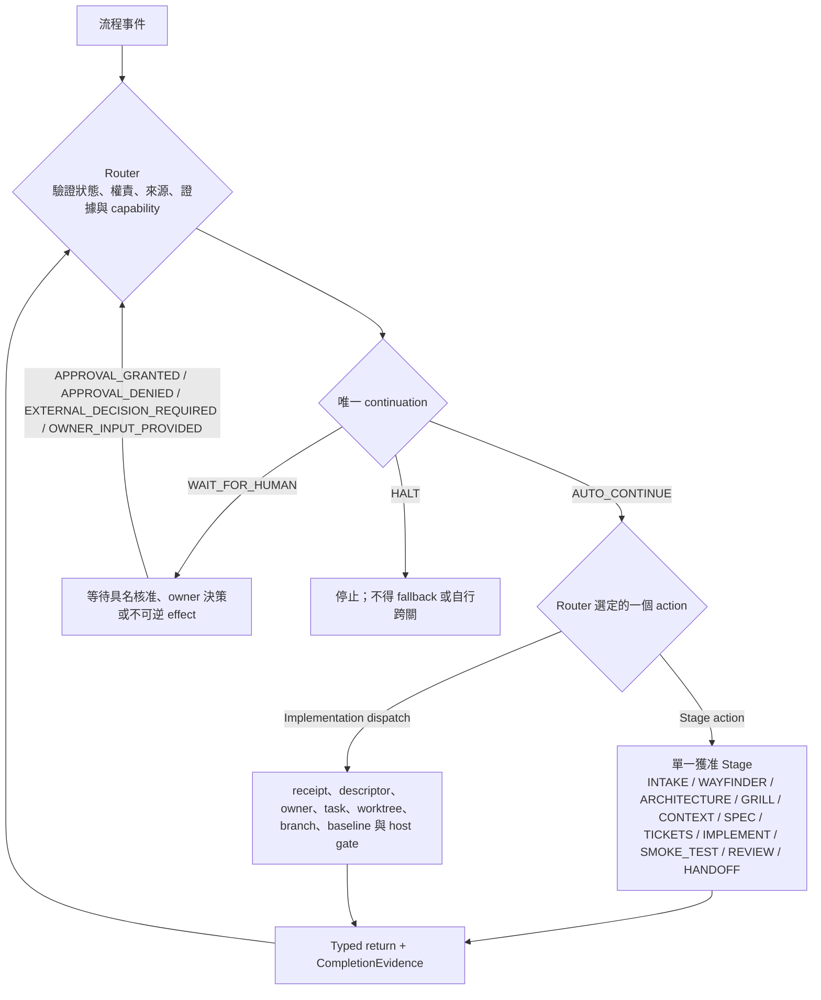

# AI 協作工程工作流程索引

> 本檔是 Johnny 控制面的流程與路由標準：定義關卡、權責、必要來源、應讀 skill
> reference、合法返回事件與下一步。它不重複各能力的操作細節；詳細方法由
> [`johnny-project-takeover`](skills/johnny-project-takeover/SKILL.md) 的單一責任
> references 定義。Code Review 的結論與證據標準以 [CodeReview.md](CodeReview.md)
> 為準。

<a id="workflow-flow"></a>

## 工作流程圖



以下只表示合法的 Stage 順序，不表示 Stage 之間可以直接 transition；每一個箭頭都必須
先以 typed event 回到 Router，再由 Router 驗證並選出唯一下一動作：

```text
INTAKE → WAYFINDER → ARCHITECTURE → GRILL → CONTEXT → SPEC → TICKETS
       → IMPLEMENT → SMOKE_TEST → REVIEW → HANDOFF
```

每次只執行 Router 宣告的一個動作；完成後以 typed event 返回 Router。Agent 不得
自行跨關、以 commit 當終點，或從聊天推測下一步。

<a id="governance-document-ownership"></a>

## P0：治理文件歸屬與插件隔離

- `AGENTS.md`、本檔、`CodeReview.md`、skills 與 references 都屬 Johnny 插件版本庫
  與安裝 bundle，由安裝快取提供。
- 以上插件治理內容不得複製、搬移、vendor、symlink 或部署到 target project，
  也不得修改 target project `.gitignore` 來管理它們。
- target project 的 Context、SPEC、tickets、進度、審閱、原始碼與測試必須
  target-owned、target-versioned；不得對插件快取形成 runtime、CI、hook、import、
  submodule 或 symlink 依賴。
- 移除插件只移除控制面能力與治理來源存取，不得刪除或改寫 target project。

## 文件層級與唯一責任

| 層級 | 唯一責任 | 不得承載 |
| --- | --- | --- |
| `AGENTS.md` | 啟動順序、P0、索引 | 流程正文或專業檢查表 |
| `Workflow.md` | 關卡、權責、skill/reference 路由、返回事件 | 詳細 schema、payload matrix、實作教學 |
| Skill `SKILL.md` | 能力入口、reference 選擇 | 所有變體的完整正文 |
| Skill reference | 一個具名關注點的唯一方法與規則 | 其他關注點的競爭規則 |
| `CodeReview.md` | 審閱入口、證據、finding 與結論 | 重複專業 skill 的完整規則 |
| target SPEC | 核准的產品行為、架構與驗收邊界 | 全域流程規則 |
| target ticket | 單張實作的完整局部契約 | 未核准需求或全域規則副本 |
| Work Progress Report | 專案層級正式來源的短索引 | 事件台帳、完整 ticket／review／handoff、receipt 或逐動作證據 |

完整 target 文件結構只能在專案負責人授權後依 `template/README.md` 建立。既有
同用途目錄優先；不得建立平行的 Context、SPEC、ticket 或 review 來源。

`WorkProgressReport.md` 不得作為 implementation 或 review 的寫入／return target；
每個動作只回傳 typed event 與 exact commit／artifact identifiers。既有 ticket 中的
`WPR-only handoff` 文字屬已退役的舊傳輸方式，不得再建立獨立 WPR commit；詳細證據
留在該 ticket／review exact leaf，歷史由 Git 定點溯源。

<a id="workflow-router"></a>

## 0. Router：索引、權責與閉迴路

Router 是確定性的流程控制層，不是事實來源、規則百科或授權替代品。高階控制面
模型可做需求、架構、拆票與審閱判斷；Router 仍以 typed state、receipt、host
capability gate 與 immutable references 約束它。

任何 Router event、continuation、completion 或 dispatch admission，完整閱讀：

- [`router-control.md`](skills/johnny-project-takeover/references/router-control.md)

Router 每次輸出必須包含：

1. 目前 stage 與唯一 action；
2. 具名 owner／reviewer 與 host 權限範圍；
3. exact artifact refs 與版本綁定的 skill reference；
4. 最小 `ContextView` 與 capability；
5. 預期 typed return 與返回 event；
6. `AUTO_CONTINUE`、`WAIT_FOR_HUMAN` 或 `HALT` 其中之一。

可持久化內容只保存 metadata；實作派送的 live
`PendingDispatchDescriptor` 由 Private Router 持有，完整不變量見
`router-control.md`。`ImplementationHandoff` 只索引核准 artifact 與具名角色，
不得成為另一份 ticket 或 Context。

缺失、不可讀、版本不符或互相競爭的 reference 固定
`HALT / ROUTE_REFERENCE_INVALID`。不得用模型記憶重建規則。

### 0.1 自動接續

- `AUTO_CONTINUE`：來源、證據、authority 與唯一 capability 完整時，執行一個
  宣告動作後重新路由。
- `WAIT_FOR_HUMAN`：只用於 Profile 宣告的核准、owner 決策或不可逆外部 effect。
- `HALT`：來源、權限、能力、驗證、安全邊界或 transition 不合法時停止。

自動接續有步數／時間 ceiling。`ACTION_COMPLETED` 必須先附
`CompletionEvidence`；commit 不能自行選下一關。

### 0.2 最小 Context

Context/source/capability 或旁路引用解析，完整閱讀：

- [`context-routing.md`](skills/johnny-project-takeover/references/context-routing.md)
- [`artifact-tree-routing.md`](skills/johnny-project-takeover/references/artifact-tree-routing.md)（索引樹與 leaf 定位時）
- [`agent-context-lifecycle.md`](skills/johnny-project-takeover/references/agent-context-lifecycle.md)（Agent working Context 建立、換票或關閉時）

Agent 只取得當前關卡的完整局部閉包，不取得完整治理庫或聊天歷史。最少 Context
不是缺少 Context：exact ticket、直接契約、適用 source span、skill reference 與
驗證入口都必須可解析。

共用專案 Context 只在 `ARCHITECTURE -> GRILL -> CONTEXT` 前期關卡建立並封存；
`SPEC` 之後的 supervisor、切票者、派單者、implementer 與 reviewer 只能引用其
revision。新事實或缺口必須經 `REQUIREMENT_CHANGED` 回到 change control，由
architecture owner 產生新 revision，不得在 ticket／handoff／review 中順手追加。

所有正式 artifact 與 Agent Context 都以樹狀索引解析；root 只列直接子節點，詳細
內容只存在 exact leaf。Router 每次只能沿目前工作所需的一條路徑載入 leaf，不得
掃描或持久化整棵樹。implementer Context 僅綁一張 ticket；換票必須關閉舊 view
並建立新 `side_context_id`，不得帶入上一票的 raw／推論 Context。

### 0.3 Profile、資源與 staging

涉及 POC／MVP／COMMERCIAL、`COMPACT`／`STANDARD`／`HIGH_ASSURANCE`、model
tier、implementer/helper 數量、POC freeze 或 staging 時，完整閱讀：

- [`delivery-profile.md`](skills/johnny-project-takeover/references/delivery-profile.md)
- [`model-role-routing.md`](skills/johnny-project-takeover/references/model-role-routing.md)（角色能力、SPEC readiness、休眠／喚醒時）

專案大小、檔案數、行數與 model 名稱不授予 authority，也不得降低 hard
escalation。預設一位 implementer、無 helper；只有互斥 ownership 與獨立 AC
成立才增加 lane。

### 0.4 關卡路由表

| Stage／條件 | 最小 target source | 必讀 reference | 合法返回 |
| --- | --- | --- | --- |
| `INTAKE`／maturity／resource | goal、authority、Profile | [`delivery-profile.md`](skills/johnny-project-takeover/references/delivery-profile.md) | `WAYFINDER` 或 blocker |
| `WAYFINDER`／`ARCHITECTURE`／`GRILL` | scoped facts、Wayfinder、change history | [`discovery-change.md`](skills/johnny-project-takeover/references/discovery-change.md) | GO／NO-GO／`WAYFINDER_INFO_REQUIRED`／completed／`REQUIREMENT_CHANGED` |
| `CONTEXT` | confirmed facts and refs | [`context-routing.md`](skills/johnny-project-takeover/references/context-routing.md) | `ACTION_COMPLETED` |
| artifact tree／Agent Context lifecycle | root/partition/leaf refs or one ticket binding | [`artifact-tree-routing.md`](skills/johnny-project-takeover/references/artifact-tree-routing.md)、[`agent-context-lifecycle.md`](skills/johnny-project-takeover/references/agent-context-lifecycle.md) | exact leaf／closed view／typed halt |
| PRD／CHG create、replace 或 archive | active requirement edge or archive bundle | [`requirement-lineage.md`](skills/johnny-project-takeover/references/requirement-lineage.md) | active pair／archive ID／typed halt |
| reusable module lookup／catalog maintenance | capability-domain index | [`module-catalog-routing.md`](skills/johnny-project-takeover/references/module-catalog-routing.md) | exact module card／gap |
| external capability admission／tier-target fit | capability metadata and target platform | [`capability-admission.md`](skills/johnny-project-takeover/references/capability-admission.md) | admitted kind+tier／regime-only／absent continue |
| `SPEC`／`TICKETS` | approved Context/CHG/architecture | [`specification-ticketing.md`](skills/johnny-project-takeover/references/specification-ticketing.md) | approval wait／`ACTION_COMPLETED` |
| SPEC readiness／model handover | exact SPEC/Profile revision | [`model-role-routing.md`](skills/johnny-project-takeover/references/model-role-routing.md) | ready／architecture owner／owner approval |
| low-model ticket admission | approved SPEC and exact ticket | [`ticket-decomposition.md`](skills/johnny-project-takeover/references/ticket-decomposition.md) | ready／split／upstream／high assurance |
| formal UI／design source | approved UI requirement and capability state | [`ui-design-handoff.md`](skills/johnny-project-takeover/references/ui-design-handoff.md) | UI contract／human wait／source halt |
| XSS trigger | untrusted-source/render/host graph | [`xss-review.md`](skills/johnny-project-takeover/references/xss-review.md) | classification／closure or halt |
| dispatch／owner／workspace | exact ticket/receipt/task/worktree | [`implementation-authority.md`](skills/johnny-project-takeover/references/implementation-authority.md) | admitted dispatch or halt |
| `IMPLEMENT`／`SMOKE_TEST` | exact admitted ticket and direct contracts | [`implementation-tdd.md`](skills/johnny-project-takeover/references/implementation-tdd.md) | `ImplementationReturn` |
| `REVIEW`／`HANDOFF` | Closure Set、diff、evidence | [CodeReview.md](CodeReview.md) | approved／correction／change／halt |
| language decision | Context、SPEC、ticket | [`language-policy.md`](skills/johnny-project-takeover/references/language-policy.md) | decision or schema halt |
| POC freeze／staging | accepted commit、repo/ref evidence | [`delivery-profile.md`](skills/johnny-project-takeover/references/delivery-profile.md) | staging admission or halt |

<a id="discovery"></a>

## 1. 需求、架構與變更流程

<a id="workflow-wayfinder"></a>

Wayfinder、Architecture、Grill 與 change-control 的唯一詳細方法：

- [`discovery-change.md`](skills/johnny-project-takeover/references/discovery-change.md)

Wayfinder `NO-GO` 停止；`GO` 才能進 Architecture。資訊不足時 Wayfinder 發出
`WAYFINDER_INFO_REQUIRED`（型別化、一輪列全、不重問、上限兩輪；規則見
`Defined_wayfinder.md` 的有界資訊缺口協議），Router 以宣告的
`WAIT_FOR_HUMAN / WAYFINDER_INPUT_GAP` 等待 owner；答案落入 committed intake
紀錄後以 `OWNER_INPUT_PROVIDED` 重入 `WAYFINDER`。需求、正式 UI、資料契約、
權限、Provider 或商業規則改變時，停止受影響 ticket，產生
`REQUIREMENT_CHANGED`，更新 target-owned Context/CHG，再重走受影響的 SPEC 與
ticket 核准。

<a id="xss-review"></a>

### 1.1 XSS Review 強制閘門

不可信資料進入 Browser、WebView、HTML／DOM Renderer 或 JavaScript execution
context 時，完整閱讀並執行：

- [`xss-review.md`](skills/johnny-project-takeover/references/xss-review.md)

JavaScript 可直接或間接觸達 Native Bridge、IPC、Extension API 或其他 privileged
capability 時，必須升級 `PRIVILEGED_XSS_REVIEW` 與 `HIGH_ASSURANCE`。分類必須在
Architecture／Grill 完成並回掛 Context、SPEC、ticket、TDD 與 review。

<a id="change-control"></a>

### 1.2 Change control

Change-control 返回路徑由 `discovery-change.md` 定義。未完成新的核准 baseline 前，
不得在舊票暗中補需求。

<a id="specification"></a>

## 2. SPEC

SPEC 建立、內容、核准、revision 與 implementation-language gate：

- [`specification-ticketing.md`](skills/johnny-project-takeover/references/specification-ticketing.md)
- [`language-policy.md`](skills/johnny-project-takeover/references/language-policy.md)（涉及語言決策時）

每個功能集群只可有一份有效 SPEC；只有 owner 明確核准才進 `APPROVED`。

<a id="tickets"></a>

## 3. Tickets

垂直切片、ticket schema、前端 composition/DI、Closure Set 與 dispatch normalization：

- [`specification-ticketing.md`](skills/johnny-project-takeover/references/specification-ticketing.md)
- [`ticket-decomposition.md`](skills/johnny-project-takeover/references/ticket-decomposition.md)（拆票與低階模型 admission）
- [`ui-design-handoff.md`](skills/johnny-project-takeover/references/ui-design-handoff.md)（正式 UI 或 design source 時）
- [`review-checks.md`](skills/johnny-project-takeover/references/review-checks.md)（設計 TDD matrix 時）

每張 ticket 是單一 implementation owner 可完成、可獨立驗證的使用者可觀察行為。
不可按前端／後端／資料庫／測試水平切割。

<a id="typed-ticket-preflight"></a>

### 3.1 強型別 schema preflight

Dispatch 前與 implementer 首次紅燈前，都必須執行
[`specification-ticketing.md#strong-type-preflight`](skills/johnny-project-takeover/references/specification-ticketing.md#strong-type-preflight)。
失敗固定 `HALT / TICKET_SCHEMA_INVALID`；不得先寫原始碼再補契約。

<a id="compact-ticket-dispatch"></a>

### 3.2 最小派送

派送只傳 `ACTION_REQUIRED`、`dispatch_ref`、`registry_commit`、`ticket`、`receipt`
與 `owner_task`；續作最多增加一行 bounded resume state。不得重抄 worktree、branch、
baseline、SPEC/AC、scope、TDD、型別矩陣、驗證、安全或 return contract。

完整規則：

- [`specification-ticketing.md#dispatch-normalization`](skills/johnny-project-takeover/references/specification-ticketing.md#dispatch-normalization)

`TICKETS + APPROVAL_GRANTED -> IMPLEMENT` 是已淘汰 transition，固定 `HALT`。

<a id="implementation"></a>

## 4. Implementation

<a id="role-boundary"></a>

### 4.1 角色、Agent 與 worktree

控制面、implementation owner、reviewer orchestration、task/worktree admission、allocation
與 same-ticket correction 的唯一規則：

- [`implementation-authority.md`](skills/johnny-project-takeover/references/implementation-authority.md)

reviewer 是唯一 Agent-to-Agent orchestrator。implementation owner 無 orchestration
capability，只能在精確綁定的 owner worktree 實作一張 admitted ticket。錯 role 固定
`HALT / ROLE_FORBIDDEN`；錯 workspace 固定 `HALT / TASK_WORKSPACE_MISMATCH`。

現行的角色→模型對應與實作者派法（依難度分派，以及「合理拆不動就升級、不硬拆」的
判準）記在 [`doc/runbooks/dispatch-model-profile.md`](doc/runbooks/dispatch-model-profile.md)。
對應會換而權責不會換，所以換模型只改那一份，不動這裡。

### 4.2 TDD、型別、Smoke Test 與 completion

實作者完整閱讀：

- [`implementation-tdd.md`](skills/johnny-project-takeover/references/implementation-tdd.md)
- ticket 指定的專業 reference（例如 XSS）

完成後回傳 `ImplementationReturn`；`COMPLETED` 產生 `ACTION_COMPLETED`，`BLOCKED`
fail-closed，`CHANGE_DETECTED` 產生 `REQUIREMENT_CHANGED`。

<a id="collaboration"></a>

## 5. 多 Agent／多 worktree

Agent 只能寫入、stage、commit、merge、rebase、pull、push、stash 或切換自己的
worktree。其他 Agent 可讀或審閱，但不得跨 worktree 修改。共享契約、Composition
Root 或 migration ownership 衝突時，先開整合 ticket 或指定單一整合者。

完整 authority、workspace 與 correction 規則：

- [`implementation-authority.md`](skills/johnny-project-takeover/references/implementation-authority.md)

<a id="security"></a>

## 6. 安全入口

Secret、正式 Log、Provider、Webhook、權限、資料刪除、部署、付費或不可逆 effect
時，完整閱讀：

- [`security-boundary.md`](skills/johnny-project-takeover/references/security-boundary.md)

不可信資料進 renderer/JavaScript 時另讀
[`xss-review.md`](skills/johnny-project-takeover/references/xss-review.md)。target 專案的
具體邊界仍由 target-owned、target-versioned 安全文件定義。

<a id="review-handoff"></a>

## 7. Code Review 與 handoff

Review 的進入、證據、finding 路由、結論與收斂限制，以
[CodeReview.md](CodeReview.md) 為唯一入口；專業檢查讀取它索引的 skill reference。

`APPROVED` 前不得 merge。`CHANGES_REQUESTED` 預設回原 ticket／owner／worktree／
branch 做 additive correction；`TICKET_DEFECT` 回 ticket；`REQUIREMENT_CHANGED` 回
change control；`OUT_OF_SCOPE_HARDENING` 另開後續票。同一 Closure revision 第二次
仍失敗時回 `CONVERGENCE_REVIEW_REQUIRED`，不得自動第三次 correction。

Handoff 必須能以 identifiers 與證據回答 SPEC/ticket/CHG、完成與未完成內容、diff、
tests/types/build/review、owner/worktree/commit、系統影響、限制、風險與回復方式。
缺一項為 `BLOCKED`。

部署、發布、push、付費、正式權限、資料刪除或正式 Secret 使用均是獨立 effect，
必須取得範圍化 authority；本流程的實作或 review 核准不自動授權它們。
